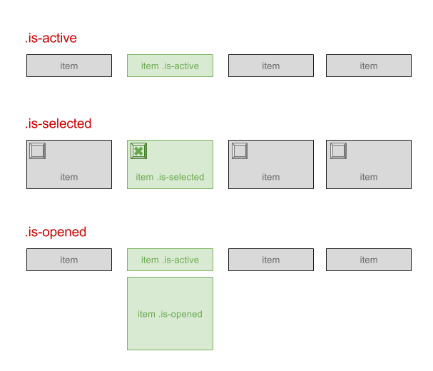

# Guidelines JavaScript

Statut : Recommendation (REC)

Cette présente convention, inspiré des recommandations d'[Alsacréations](https://www.alsacreations.com), rassemble les bonnes pratiques JavaScript que nous souhaitons retrouver dans vos projets. Elle a pour but d'évoluer dans le temps et de s'adapter à chaque nouveau projet.

## Généralités

- Dans la mesure du possible sur de petits scripts d'agrément (ex.: visuel), JavaScript apporte une amélioration progressive, c’est-à-dire qu’il se produit une dégradation gracieuse lorsqu’il est désactivé (on peut toujours accéder au contenu). Ces scripts doivent être placés de préférence en fin de document, avant la balise `</body>`(ceci n’est plus extrêmement significatif suite aux optimisations des navigateurs, mais permet d’éviter les écueils majeurs et de visualiser l’ordre de chargement au même endroit). Les attributs `defer` et `async` seront utilisés à bon escient pour réduire la latence (voir [Article](http://www.alsacreations.com/astuce/lire/1562-script-attribut-async-defer.html)).
- L’appel à une librairie ou à un framework (ex: jQuery, Vue, React) fait toujours apparaitre le numéro de version et le suffixe `-min` si le fichier a été minifié.
- Les scripts de production doivent nécessairement être minifiés et uglifiés vers un seul fichier afin de réduire le nombre et la taille des requêtes.

### Syntaxe

- L’encodage des fichiers et des bases de données doit se faire en UTF-8.
- Valider le code avec [eslint](https://eslint.org/).
- Les indentations se font à l’aide de deux espaces, idéalement définies par [EditorConfig](http://editorconfig.org/).
- Utiliser la syntaxe _lowerCamelCase_ (voir <https://fr.wikipedia.org/wiki/CamelCase>) pour l'écriture des noms de variables, fonctions, objets, etc.
- Utiliser le mot-clé  `let` ou `const` pour déclarer une variable ou une constante et maitriser sa portée.
- Terminer les instructions par un `;` sauf si la configuration eslint du projet le permet autrement.
- Commenter, si nécessaire, le code, les fonctions, les variables (à l’aide de `//` ou `/* */`). Il devient nécessaire de mettre à jour ces commentaires dès lors que la fonction évolue.
- Ne jamais laisser un appel à `console.log()` ou `eval()` dans le code en production.
- Ne pas déclarer de fonctions/variables dans le scope global qui pourraient amener à des conflits avec d’autres scripts. Si besoin, utiliser une [IIFE](https://en.wikipedia.org/wiki/Immediately-invoked_function_expression). Voyez si votre exécuteur de tâches, par exemple, Webpack, Laravel-mix, etc. ne gèrent pas cela pour vous.
- En cas de manipulation du DOM, nommer les fonctions/plugins d’après les classes HTML avec lesquelles elles vont interagir.
- Éviter toute forme de redondance ou code dupliqué.

En bonus, suivre les recommandations de :

- [Airbnb JavaScript Style Guide](https://github.com/airbnb/javascript)
- [Principe d'écriture d'un code JavaScript cohérent et idiomatique](https://github.com/rwaldron/idiomatic.js/tree/master/translations/fr_FR)
- [clean-code-JavaScript](https://github.com/ryanmcdermott/clean-code-javascript/blob/master/README.md)
- [JavaScript The Right Way](https://jstherightway.org/)


## Chaines de texte

Utiliser les simples guillemets `'` pour conserver une consistance et faciliter l’écriture du HTML, ou les doubles guillemets pour du multiligne.

Dans la mesure du possible, ne pas stocker les textes "traduisibles" dans les fichiers JavaScript, mais passer par le code HTML, éventuellement caché ou dans des attributs `data-*`.

## Commentaires

Pour les brefs commentaires, le double slash `//` sur une seule ligne est privilégié. Il permet à plus grande échelle de désactiver un bloc de code par `/* */` qui englobe ces courts commentaires sans être gêné. Les commentaires plus conséquents, en introduction de fichier ou de description de fonctions, doivent se faire avec des blocs `/** */`. Si le commentaire ne doit pas être supprimé à la minification, la syntaxe `/*! */` le permet.

## Closures

Pour isoler le code JavaScript des autres scripts externes (frameworks, plug-ins...) et ne pas engendrer des conflits de variables, il est nécessaire d’encapsuler les instructions dans un bloc de fonction.

```js
(function() {
  "use strict";
  // Le code…
})();
```

### Convention de nommage

- Exploiter au maximum le document "statique" HTML, dont ses attributs `data-*`, les classes, ou l’ordre des éléments pour construire un script autour, plutôt que de se reposer uniquement sur JavaScript ou des variables indépendantes de la structure HTML.
- Placer les attributs `data-*` sur les éléments pour lesquels ils seront utiles, notamment le conteneur du plugin/composant.
- Différencier classes qui vont permettre de styler l’élément (dans les fichiers CSS) et classes qui vont permettre d’activer un comportement spécifique JS sur l’élément (fichiers JS) en les préfixant par `js-`.

```html
<div class="slideshow js-slideshow" data-timing="2000" ...>
   <figure class="slideshow-item">
```

## Classes suggérées



- `.is-active` pour un élément qui est tout le temps visible, mais qui peut avoir un état actif/inactif (ex. : élément de menu ou de sous-menu au focus/survol).
- `.is-selected` pour un élément qui est tout le temps visible, mais qui peut avoir un état sélectionné/désélectionné (ex : bouton/bloc radio/checkbox).
- `.is-opened` pour un élément qui peut avoir deux états affiché ou masqué (ex. : menu déroulant, panel d'accordéon). Inverse possible : `.is-closed`.

- Utiliser les classes CSS du projet pour cacher/masquer des éléments, lancer des transitions, ou changer leur état

- De même pour les animations/transitions, il est souvent préférable de passer par l’ajout/suppression de classes CSS.

## Interactions et évènements

- Se reposer sur les éléments pouvant recevoir le focus (`<a>`, `<button>`, `<input>`) pour l’ajout d’évènements `onclick`, etc.
- Toujours écrire les gestionnaires d'évènement avec `.on()` pour les retrouver plus facilement dans le code plutôt qu'avec les alias.
- Penser à prévoir les cas de figure où le code peut être appelé plusieurs fois dans une même page, ou plusieurs fois par erreur sur un même élément (par exemple avec la gestion `.off()` et `.on()` des évènements, les attributs `data-*` pour savoir s’il a déjà été appliqué, etc).
- Suivre le principe des _Optimistic Updates_ : les opérations du visiteur prennent effet immédiatement pour ne pas attendre, et son corrigées une fois le résultat réel de l'opération retournée par le serveur.

## ARIA et accessibilité

Exploiter les [propriétés/états](https://www.w3.org/TR/wai-aria/states_and_properties) ARIA pour les composants dynamiques :

- Ajouter/supprimer l'attribut `aria-hidden="true"` pour les éléments qui ne doivent pas être visibles ni rendus vocalement. Celui-ci peut être décorélé de `.visually-hidden`.
- Utiliser les attributs `aria-selected`, `aria-checked`, `aria-expanded`, `aria-controls` le cas échéant.
- Utiliser `aria-live` pour les zones de contenu se mettant à jour en JavaScript et devant être signalées.

Exploiter les [rôles](https://www.w3.org/TR/wai-aria/roles) pour les composants complexes (ex : onglets avec `tab`, `tabpanel`, `tablist`... accordéons et sliders divers).

Vérifier que la navigation au clavier par tabulations suit un cheminement logique et n'est pas capturée par un élément sans possibilité d'en sortir. Ajouter en JavaScript `tabindex="-1"` sur les éléments ne devant plus recevoir le focus (ex : items de formulaire dans un parent masqué par `.visually-hidden`). Utiliser `tabindex` si c'est nécessaire pour changer l'ordre de tabulation (voir [Using the tabindex attribute](https://www.paciellogroup.com/blog/2014/08/using-the-tabindex-attribute/)).

